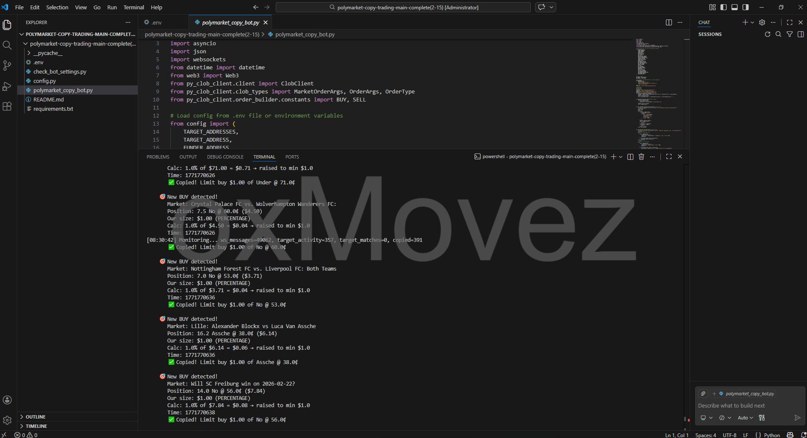
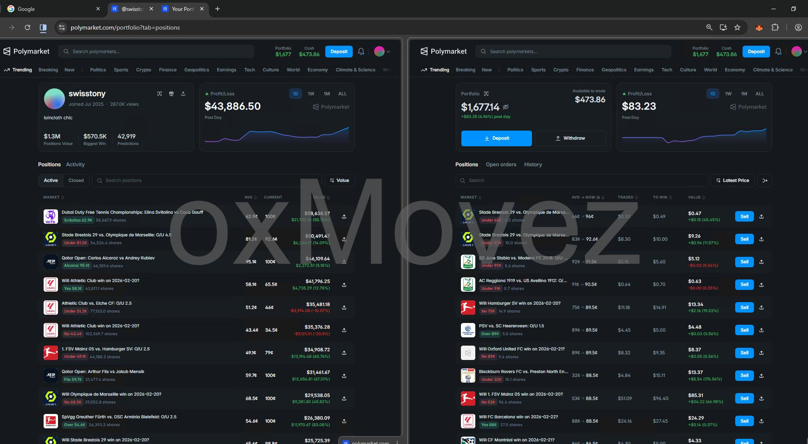
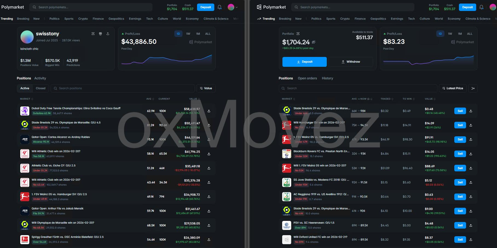

# Polymarket Copy Trading Bot – Automated Copy Trading for Polymarket Prediction Markets

**English** | [中文版 / Chinese](README_CN.md)

**Contact:** [Telegram @movez_x](https://t.me/movez_x)

---

## What Is This Bot?

A **Polymarket copy trading bot** that mirrors trades from target wallets in real time.

- **Copy all kinds of trades** – BUY and SELL, any market
- **Exact same copy** – Same side, same market, same timing
- **Multiple traders** – Follow several traders at once
- **4 order size modes** – FIXED, PERCENTAGE, ADAPTIVE, MIRROR
- **Fast order placement** – WebSocket + HTTP backup, suitable for HFT-style copy
- **Risk management** – Order caps, position limits, slippage control
- **Python-based** – Ready for future AI features

---

## Screenshots

*You can see real trade history in the screenshots below.*

**1. Bot configuration & dashboard**


**2. Real-time trade execution**



**3. Trade history log**



**4. Multi-trader setup**



**5. Risk management settings**


---

## 5 Advantages for Traders

1. **Passive income** – Copy proven traders 24/7 without manual trading.
2. **Exact mirror** – Same BUY/SELL, same markets, same timing; true copy.
3. **Diversification** – Follow multiple traders to spread risk.
4. **Risk control** – Order caps, position limits, and slippage protect your capital.
5. **Transparent history** – Real trade history in the screenshots above; verifiable.

---

## Basic Copy Bot

This is a basic copy bot. For full code, custom features, help, or premium support, contact via Telegram.

---

## How to Run

```bash
# 1. Copy config
cp .env.example .env

# 2. Edit .env – set TARGET_ADDRESSES, FUNDER_ADDRESS, PRIVATE_KEY

# 3. Install dependencies
pip install -r requirements.txt

# 4. Run (use DRY_RUN=true first to test)
python polymarket_copy_bot.py
```

---

## Contact

**Telegram:** [@movez_x](https://t.me/movez_x)

